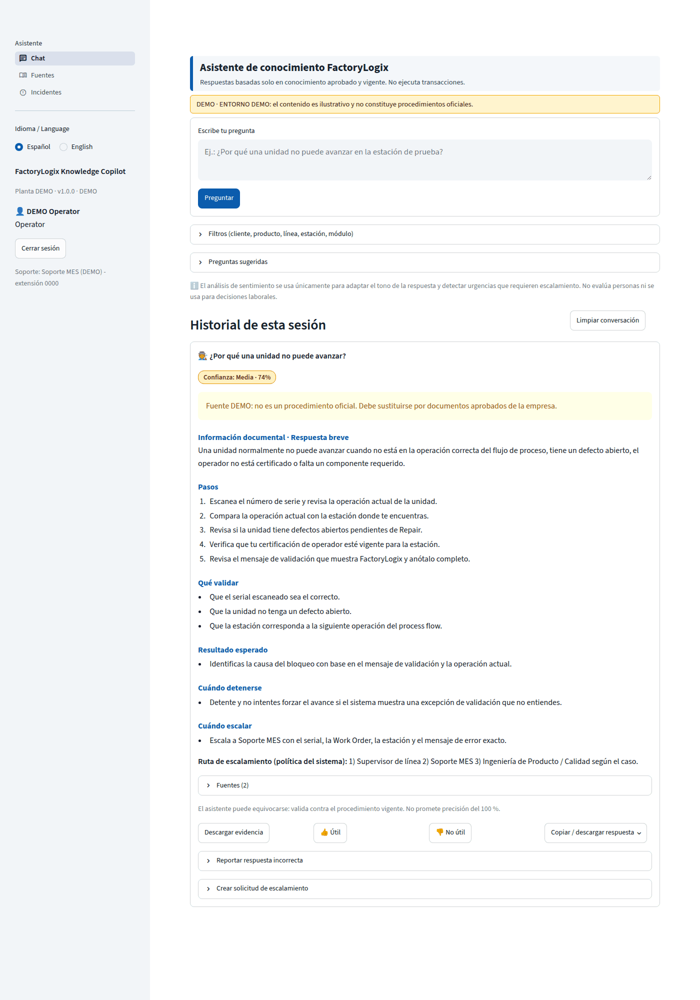
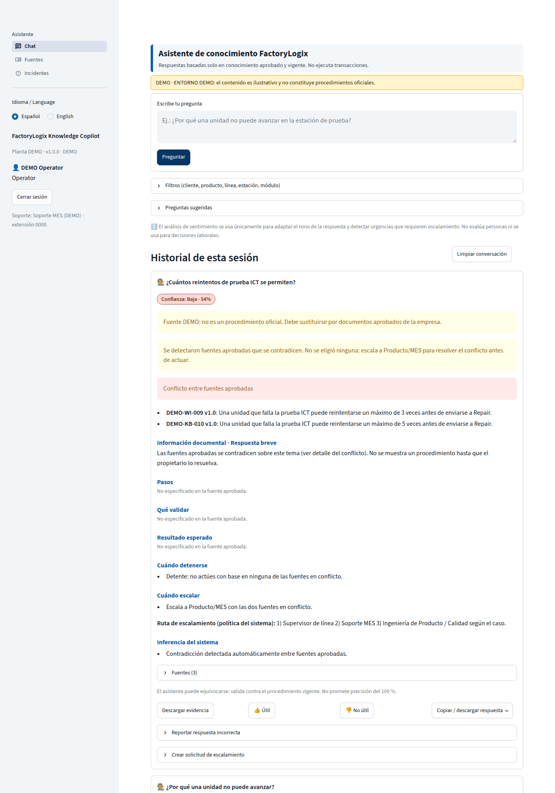
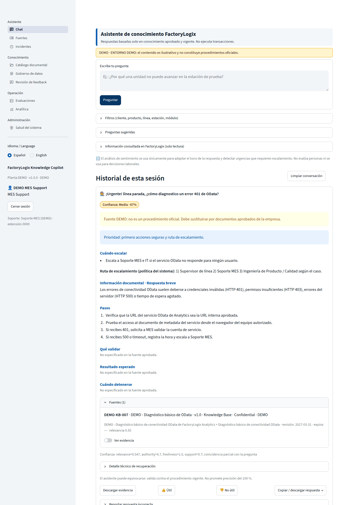

# FactoryLogix Knowledge Copilot

**Versión 1.0.1 · Entorno inicial: DEMO**

Asistente inteligente interno para operadores, supervisores, Producto, Calidad, NPI, Ingeniería de Manufactura y
MES. Responde **solo con conocimiento aprobado y vigente**, muestra siempre las fuentes (documento, versión,
sección/página) y un nivel de confianza calculado con criterios de calidad, vigencia y aprobación. Si no hay
evidencia suficiente responde:

> “No encontré información aprobada suficiente para confirmar esta respuesta. Consulta a MES, Producto o al
> supervisor responsable.”

El asistente **no ejecuta transacciones** en FactoryLogix (Proceed, Unproceed, Reroute, cierre de defectos).

---

## Características principales

| Área | Qué incluye |
|---|---|
| Chat | Pregunta grande, sugerencias, filtros (cliente, producto, línea, proceso, estación, módulo), historial, respuesta estructurada (breve, pasos, qué validar, resultado esperado, cuándo detenerse, cuándo escalar, fuentes, confianza), evidencia descargable, feedback, reporte de respuesta incorrecta, escalamiento con captura. ES/EN. |
| RAG local | Búsqueda híbrida SQLite FTS5 (BM25) + vectores locales + filtros + fusión RRF + reranking + umbral. Respaldo BM25 en Python si FTS5 no existe. Modo extractivo sin LLM; LLM local opcional (Ollama / llama.cpp) con verificación de fidelidad. |
| Training Center | Carga PDF/DOCX/XLSX/CSV/TXT/MD/HTML (imágenes con OCR opcional), metadatos completos, revisión del texto, duplicados (hash y similitud), prompt injection, aprobación con segregación de funciones, pruebas previas a publicar, publicación, versiones, comparación, rollback, Q&A aprobadas, exportación JSONL, reindexación. |
| Gobierno | Clasificación Public/Internal/Confidential/Restricted, estados Draft/Under Review/Approved/Rejected/Expired/Archived, catálogo, linaje documento→fragmento→respuesta, retención, eliminación autorizada, vigencia automática, matriz de acceso, registro de cambios y aprobaciones, reporte de fuentes sin propietario o sin revisión vigente, detección de contradicciones. |
| Seguridad | RBAC de 10 roles, scrypt, bloqueo por intentos, anti-enumeración, expiración de sesión, rate limiting, validación de archivos (firma, zip bomb, macros), path traversal, XSS, SQLi, CSV injection, redacción de secretos en logs, auditoría append-only con cadena de hashes. |
| Sentimiento responsable | Local ES/EN (Neutral, Confused, Frustrated, Urgent, Satisfied), solo para adaptar tono y detectar urgencias; desactivable; retención limitada; sin rankings ni uso laboral. |
| Conectores | OData de FactoryLogix Analytics **solo lectura**, desactivado por defecto, con timeout, reintentos, backoff, circuit breaker, caché y manejo de 401/403/404/429/5xx/timeout. xTend: reservado (deshabilitado). |
| Operación | Incidentes (CSV + reporte imprimible), analítica agregada, evaluación RAG, auditoría, usuarios, configuración (marca, colores, logo), salud del sistema, respaldos. |

## Capturas

| Respuesta a operador | Conflicto entre fuentes | Urgencia (MES) |
|---|---|---|
|  |  |  |

## Inicio rápido en Windows (sin PowerShell, sin administrador)

1. Copia la carpeta `factorylogix_knowledge_copilot` a una ruta con permisos de escritura
   (por ejemplo `C:\Users\<usuario>\Apps\`). Evita `C:\Program Files`.
2. Doble clic en **`INSTALAR_WINDOWS.bat`**. Detecta `py`/`python`, valida la versión, crea `.venv`, instala
   dependencias (o usa `wheelhouse\` sin Internet) e inicializa la base de datos con los datos DEMO.
3. Anota la **contraseña temporal de `admin`** que aparece en pantalla (también queda en
   `data\PRIMER_ACCESO_ADMIN.txt` hasta que la cambies).
4. Doble clic en **`INICIAR_WINDOWS.bat`** (solo este equipo) o **`INICIAR_RED_INTERNA_WINDOWS.bat`** (red interna).
   Se abre el navegador; la URL se muestra en la ventana.
5. Inicia sesión como `admin`, cambia la contraseña (obligatorio) y explora.
6. Para detener: cierra la ventana o ejecuta **`DETENER_WINDOWS.bat`**.

> Desde una consola (cmd o PowerShell) dentro de la carpeta también puedes usar
> `.venv\Scripts\python.exe app.py` (opcional: `--bind network`). No uses un Python sin el entorno `.venv`.
> Antes de esta versión, `python app.py` solo mostraba avisos `missing ScriptRunContext` porque Streamlit requiere
> su servidor; ahora delega automáticamente al lanzador.

Detalles: [docs/MANUAL_INSTALACION.md](docs/MANUAL_INSTALACION.md).

### Usuarios DEMO

En entorno `DEMO` se crea un usuario por rol (`demo_operator`, `demo_supervisor`, `demo_knowledge_manager`,
`demo_data_steward`, `demo_mes_support`, `demo_auditor`, …) con contraseñas **aleatorias** guardadas en
`data\USUARIOS_DEMO.txt`. Desactívalos (o cambia el entorno a `PILOT`/`PRODUCTION`) antes de un piloto.

## Requisitos

- Windows 10/11 x64, Python 3.10–3.13 (recomendado 3.11 o 3.12). Python instalado “solo para el usuario” es válido.
- Sin Node.js, npm, Docker, React, nube ni APIs de OpenAI/Claude.
- Estaciones de producción: solo navegador.

## Estructura

Ver [docs/ARBOL_CARPETAS.md](docs/ARBOL_CARPETAS.md) y [docs/ARQUITECTURA.md](docs/ARQUITECTURA.md).

```
app.py            Entrada Streamlit (autenticación + navegación por permisos)
pages/            Páginas de interfaz (solo presentación)
ui/               Tema, i18n, componentes, estado de sesión
services/         Casos de uso (chat, conocimiento, feedback, incidentes, evaluación, ...)
rag/              Recuperación híbrida, conflictos, confianza, respuesta, LLM local
ingestion/        Extracción, limpieza, fragmentación, pipeline
governance/       Ciclo de vida y políticas
security/         Autenticación, RBAC, sanitización, validación de archivos, injection
sentiment/        Análisis de sentimiento responsable
connectors/       OData solo lectura, circuit breaker, caché
repositories/     Acceso a datos (SQL parametrizado)
database/         Esquema y conexión SQLite (preparado para SQL Server)
config/           settings.yaml, rules.yaml, eval_set.yaml, odata_entities.yaml
demo_data/        Documentos DEMO + manifiesto
tests/            Unitarias, integración, seguridad, RAG
docs/             Manuales, guías, arquitectura, amenazas, gobierno
scripts/          Lanzador, parada, verificación, respaldo de admin, generación de docs, empaquetado
```

## Pruebas

```bat
.venv\Scripts\python.exe -m pip install -r requirements-dev.txt
.venv\Scripts\python.exe -m pytest
```

Resultados reales de la última ejecución: [docs/REPORTE_PRUEBAS.md](docs/REPORTE_PRUEBAS.md).

## Documentación

| Documento | Contenido |
|---|---|
| [MANUAL_INSTALACION](docs/MANUAL_INSTALACION.md) | Instalación, red interna, sin Internet, solución de problemas |
| [MANUAL_USUARIO](docs/MANUAL_USUARIO.md) | Uso del chat, fuentes, feedback, incidentes |
| [MANUAL_ADMINISTRADOR](docs/MANUAL_ADMINISTRADOR.md) | Usuarios, configuración, salud, respaldos, recuperación |
| [GUIA_GOBIERNO_DATOS](docs/GUIA_GOBIERNO_DATOS.md) | Clasificación, estados, metadatos, prioridad, conflictos |
| [GUIA_AGREGAR_CONOCIMIENTO](docs/GUIA_AGREGAR_CONOCIMIENTO.md) | Plantilla de documentos y flujo de publicación |
| [GUIA_ACTUALIZAR_REGLAS](docs/GUIA_ACTUALIZAR_REGLAS.md) | Glosario, patrones de seguridad, léxico de sentimiento |
| [GUIA_ODATA_SEGURO](docs/GUIA_ODATA_SEGURO.md) | Conexión de solo lectura a FactoryLogix Analytics |
| [ARQUITECTURA](docs/ARQUITECTURA.md) | Diagramas Mermaid, flujo RAG, decisiones |
| [MODELO_AMENAZAS](docs/MODELO_AMENAZAS.md) | STRIDE, controles, riesgos residuales |
| [CHECKLIST_SEGURIDAD](docs/CHECKLIST_SEGURIDAD.md) | Lista de verificación para piloto/producción |
| [MATRIZ_RBAC](docs/MATRIZ_RBAC.md) | Permisos y clasificación por rol (generado) |
| [DICCIONARIO_DATOS](docs/DICCIONARIO_DATOS.md) | Tablas, campos y significado |
| [ESQUEMA_BASE_DATOS](docs/ESQUEMA_BASE_DATOS.md) | Modelo relacional y migración a SQL Server |
| [POLITICA_RETENCION](docs/POLITICA_RETENCION.md) | Retención de documentos, consultas y sentimiento |
| [PLAN_RESPALDO_RESTAURACION](docs/PLAN_RESPALDO_RESTAURACION.md) | Respaldos y restauración |
| [INVENTARIO_DEPENDENCIAS_LICENCIAS](docs/INVENTARIO_DEPENDENCIAS_LICENCIAS.md) | Paquetes y licencias (generado) |
| [DEMO_PILOTO_PRODUCCION](docs/DEMO_PILOTO_PRODUCCION.md) | Separación DEMO/piloto/producción y datos requeridos |
| [REPORTE_PRUEBAS](docs/REPORTE_PRUEBAS.md) | Resultados reales de pruebas |

## Limitaciones conocidas (resumen)

- Los scripts `.bat` se revisaron estáticamente; la lógica de arranque (Python) se probó en Linux. Validar en un
  equipo Windows 11 de la planta antes del piloto.
- Embeddings por defecto: hashing local (similitud léxica difusa, no semántica profunda). La cobertura bilingüe usa
  el glosario de `config/rules.yaml`. Para semántica real, instalar el modelo multilingüe opcional.
- OCR y LLM local son opcionales y no se probaron contra Tesseract/Ollama reales (sí con dobles de prueba).
- La detección de contradicciones es heurística (cifras distintas / negación en oraciones equivalentes).
- El contenido DEMO no es oficial. Ver [docs/DEMO_PILOTO_PRODUCCION.md](docs/DEMO_PILOTO_PRODUCCION.md).
