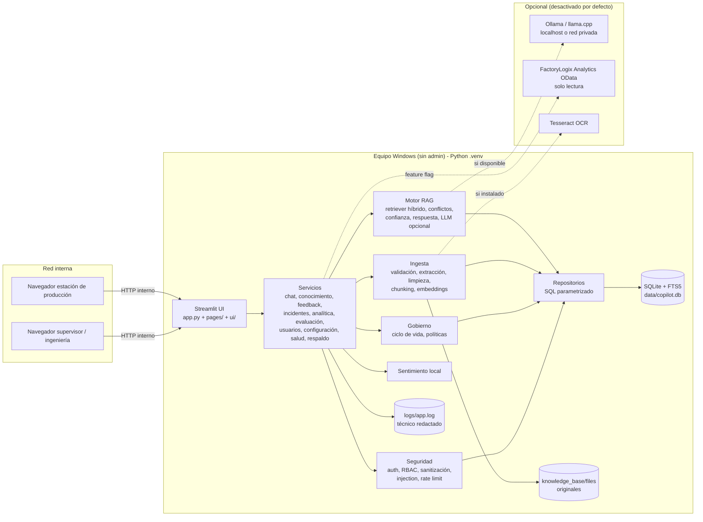
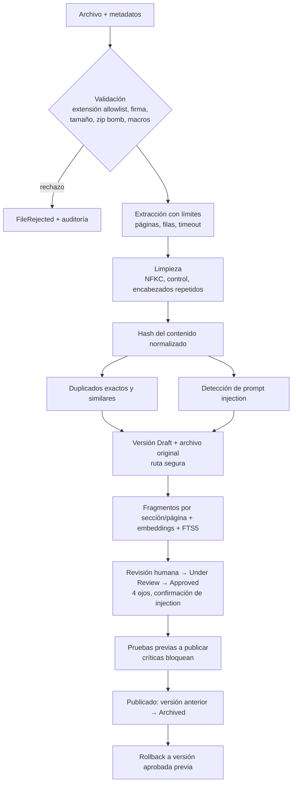
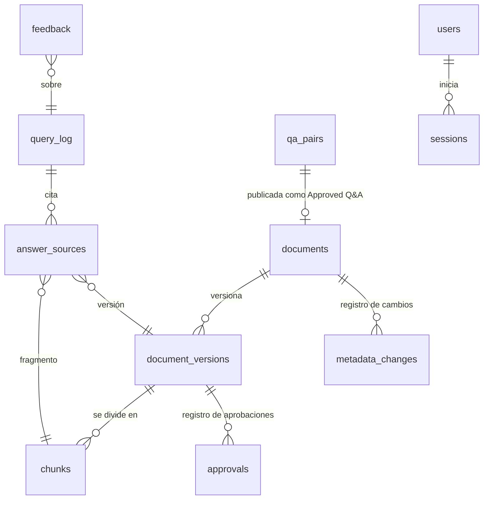

# Arquitectura

## 1. Vista general



Principios:

1. **Separación de capas**: las páginas solo presentan; la lógica vive en `services/`, `rag/`, `ingestion/`,
   `governance/`, `security/`. Los repositorios son la única capa que habla SQL.
2. **Local primero**: nada sale de la red. Telemetría de Streamlit desactivada. LLM y OData restringidos a hosts
   locales/privados o allowlist.
3. **Degradación segura**: sin LLM → modo extractivo; sin FTS5 → BM25 en Python; sin OCR → mensaje claro; OData
   caído → circuit breaker y mensajes por código HTTP.
4. **Gobierno en el dato**: la elegibilidad (aprobado + publicado + vigente + activo + clasificación permitida) se
   aplica en la consulta SQL antes de cualquier ranking.

## 2. Flujo RAG

```mermaid
sequenceDiagram
    autonumber
    participant U as Usuario
    participant C as ChatService
    participant S as Sentimiento
    participant R as HybridRetriever
    participant DB as SQLite (FTS5 + vectores)
    participant E as RagEngine
    participant L as LLM local (opcional)
    participant A as Auditoría / query_log
    U->>C: Pregunta + filtros
    C->>C: RBAC, rate limit, sanitización, idioma
    C->>S: Analizar tono (si habilitado)
    C->>E: answer(pregunta, clearance del rol)
    E->>R: retrieve()
    R->>DB: Chunks elegibles: Approved + publicado + vigente + activo + clasificación permitida + filtros
    R->>DB: BM25 (FTS5) con términos expandidos por glosario ES/EN
    R->>R: Similitud vectorial local, fusión RRF, cobertura de conceptos, reranking (autoridad + filtros)
    R-->>E: Top-k con relevancia
    E->>E: Recalcular relevancia sin oraciones de prompt injection
    alt relevancia < umbral
        E-->>C: "No encontré información aprobada suficiente..."
    else evidencia suficiente
        E->>E: Detección de contradicciones (cifras / negación)
        E->>E: Confianza = relevancia + autoridad + vigencia + respaldo (topes: DEMO, conflicto, 95 %)
        E->>E: Respuesta extractiva estructurada (breve, pasos, validar, esperado, detenerse, escalar)
        opt LLM disponible y sin conflicto
            E->>L: Fuentes como DATOS + pregunta
            L-->>E: Redacción
            E->>E: Verificación de fidelidad (grounding) e injection; si falla, se descarta
        end
    end
    C->>C: Seguridad física, solicitud de transacción, injection en pregunta
    C->>A: query_log (pregunta redactada, linaje de fuentes, sentimiento con expiración) + auditoría de restringidos
    C-->>U: Respuesta + fuentes + confianza + avisos + ruta de escalamiento
```

### Elegibilidad de fragmentos (consulta SQL)

`documents.deleted_at IS NULL` ∧ `classification ∈ clearance(rol)` ∧ `is_active = 1` ∧
`version.id = published_version_id` ∧ `version.status = 'Approved'` ∧ `effective_date ≤ hoy` ∧
(`expiration_date` vacío ∨ `> hoy`) ∧ filtros (campo vacío = documento genérico).

### Confianza

`score = 0.5·relevancia + 0.2·autoridad(tipo) + 0.15·vigencia(revisión) + 0.15·respaldo(n.º documentos)`

- Autoridad: Procedure 1.0, Work Instruction 0.95, Manual 0.85, Knowledge Base 0.7, FAQ/Q&A 0.6.
- Vigencia: revisión vencida 0.4, sin fecha 0.6, próxima 0.85, vigente 1.0.
- Topes: DEMO máximo “Medium”; conflicto → “Low”; máximo 95 %.
- Niveles: High ≥ 0.75, Medium ≥ 0.55, Low < 0.55; sin evidencia → “None”.

## 3. Ingesta



## 4. Datos y linaje



## 5. Decisiones técnicas

| Decisión | Motivo | Alternativa preparada |
|---|---|---|
| Streamlit | Python puro, sin Node/React, interfaz web para estaciones con solo navegador | — |
| SQLite + FTS5 | Sin servidor, sin admin, BM25 nativo | `Database` encapsula el dialecto; ver `ESQUEMA_BASE_DATOS.md` para SQL Server |
| Embeddings por hashing | 100 % local, sin descargas ni torch; funciona en equipos sin admin | `sentence_transformers` opcional con modelo local |
| Respuesta extractiva | Sin alucinaciones por construcción; funciona sin LLM | LLM local con verificación de fidelidad |
| scrypt (stdlib) | Sin dependencias nativas extra | PBKDF2-SHA256 600k si scrypt no existe |
| Auditoría con triggers + cadena de hashes | Inmutable desde la app y con evidencia de manipulación | Exportación periódica a SIEM |
