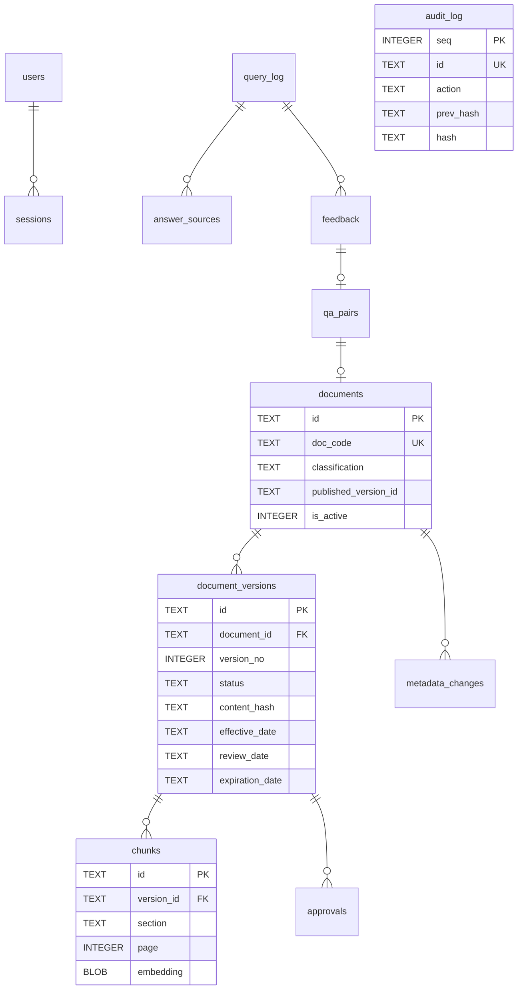

# Esquema de base de datos

Fuente de verdad: [`database/schema.sql`](../database/schema.sql) (se aplica automáticamente al iniciar).
Versión de esquema: tabla `schema_version` (actual: 1).

## Diagrama

## Integridad y seguridad en la base

- `PRAGMA foreign_keys=ON`, `journal_mode=WAL`, `busy_timeout=30000`.
- `audit_log`: triggers `audit_no_update` y `audit_no_delete` abortan cualquier modificación; cada fila guarda
  `prev_hash` y `hash` (SHA-256 canónico) — `AuditRepository.verify_chain()` detecta alteraciones.
- Todas las consultas son parametrizadas; los `UPDATE` dinámicos usan nombres de columna en allowlist.

## Migración a SQL Server (preparada, no implementada)

`database/connection.py::Database` expone `execute`, `query`, `query_one`, `scalar`, `transaction`, `init_schema`.
Para SQL Server:

1. Implementar `SqlServerDatabase` con la misma interfaz usando `pyodbc` (driver ODBC 18) y parámetros `?`.
2. Traducir tipos: `TEXT`→`NVARCHAR(MAX)`/`NVARCHAR(n)`, `INTEGER`→`INT`/`BIT`, `REAL`→`FLOAT`,
   `BLOB`→`VARBINARY(MAX)`, `AUTOINCREMENT`→`IDENTITY(1,1)`.
3. Reemplazar `ON CONFLICT ... DO UPDATE` por `MERGE` en `SettingsRepository.put`.
4. Reemplazar FTS5 por Full-Text Search (`CONTAINSTABLE` con `RANK`) en `ChunkRepository.fts_search`, o usar el
   respaldo BM25 en Python (ya implementado) mientras se habilita el índice.
5. Triggers de auditoría: `INSTEAD OF UPDATE, DELETE` que hagan `THROW`; además, permisos `DENY UPDATE, DELETE`.
6. Migrar datos con un script de exportación tabla por tabla conservando IDs y `audit_log.seq`.
