# Guía de gobierno de datos

## 1. Clasificación

| Nivel | Uso | Roles con acceso (por defecto) |
|---|---|---|
| Public | Información general sin riesgo | Todos |
| Internal | Procedimientos e instrucciones de uso general en planta | Todos |
| Confidential | Diagnóstico técnico, configuraciones, datos de cliente | Supervisor, Ingeniería, Calidad, NPI, MES, Knowledge Manager, Data Steward, Administrador, Auditor |
| Restricted | Correcciones administrativas, procedimientos de alto impacto | MES Support, Data Steward, Administrador, Auditor |

Configurable en `config/settings.yaml → access_matrix`. Solo Data Steward/Administrador cambian clasificación,
retención, propietario o aprobador.

## 2. Metadatos obligatorios

ID único (`id`), código (`doc_code`), nombre, descripción, tipo de fuente, propietario, aprobador, área, cliente,
producto, línea, proceso, estación, módulo de FactoryLogix, clasificación, estado (por versión), versión, fecha de
creación, fecha efectiva, fecha de revisión, fecha de expiración, hash del contenido y política de retención.
Ver `docs/DICCIONARIO_DATOS.md`. Cliente/producto/línea/proceso/estación vacíos significan “aplica a todos”.

## 3. Estados y transiciones

```mermaid
stateDiagram-v2
    [*] --> Draft: carga
    Draft --> UnderReview: enviar a revisión
    Draft --> Archived: descartar
    UnderReview --> Approved: aprobar (otra persona; confirmar injection)
    UnderReview --> Rejected: rechazar (motivo)
    UnderReview --> Draft: regresar
    Approved --> Archived: reemplazada / archivada
    Approved --> Expired: fecha de expiración
    Rejected --> Archived
    Expired --> Archived
    Archived --> Approved: rollback (solo si fue aprobada)
```

`Under Review` y `Draft` **nunca** se usan para responder. Solo la versión **publicada** de un documento **activo**,
en estado `Approved` y vigente, es recuperable.

## 4. Prioridad de fuentes

1. Procedimiento vigente aprobado
2. Instrucción de trabajo vigente
3. Manual oficial aprobado
4. Base de conocimiento aprobada
5. FAQ / Q&A aprobada
6. Contenido en revisión: nunca para respuestas operativas

La prioridad pesa en el reranking y en la confianza. **Contradicciones**: si dos fuentes aprobadas se contradicen
(cifras distintas o negación en oraciones equivalentes), el asistente no elige; muestra ambas, baja la confianza
a “Low” y pide escalamiento. El propietario debe corregir y publicar una nueva versión.

## 5. Controles operativos

| Control | Dónde |
|---|---|
| Catálogo de datos | Catálogo documental (exportable a CSV) |
| Linaje documento → versión → fragmentos → respuestas | Gobierno → Linaje (y por Query ID) |
| Registro de cambios de metadatos | Gobierno → Registros (`metadata_changes`) |
| Registro de aprobaciones | Gobierno → Registros (`approvals`) |
| Vigencia y avisos de vencimiento (30 días) | Gobierno → Vigencia; Analítica |
| Fuentes sin propietario / sin revisión vigente | Gobierno → Vigencia (exportable) |
| Retención y eliminación autorizada | Gobierno → Retención |
| Duplicados | Training Center (hash exacto y similitud ≥ 0.95) |
| Pruebas antes de publicar | Training Center → Publicar |

## 6. Roles de gobierno

- **Propietario**: responsable del contenido y su revisión periódica.
- **Knowledge Manager**: carga, edita, propone y publica.
- **Data Steward**: metadatos, clasificación, vigencia, retención, aprobación y eliminación autorizada.
- **Auditor**: verificación independiente (solo lectura).

## 7. Correcciones y aprendizaje

El asistente **no aprende de las conversaciones**. Una corrección entra a la bandeja de Feedback, se convierte en
Q&A propuesta y solo se publica cuando **otra persona** la aprueba. Las Q&A aprobadas pueden exportarse a JSONL
para un fine-tuning futuro, que no se ejecuta automáticamente.
